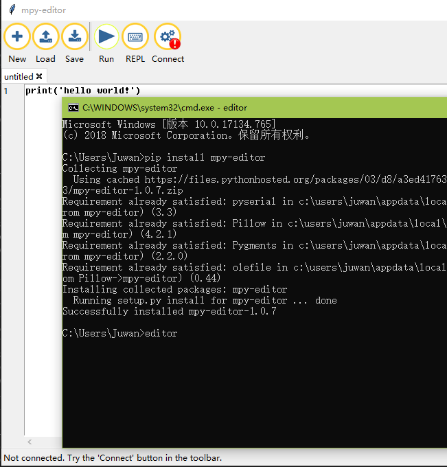
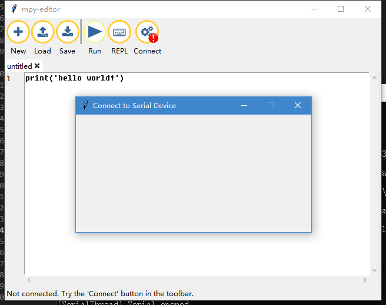
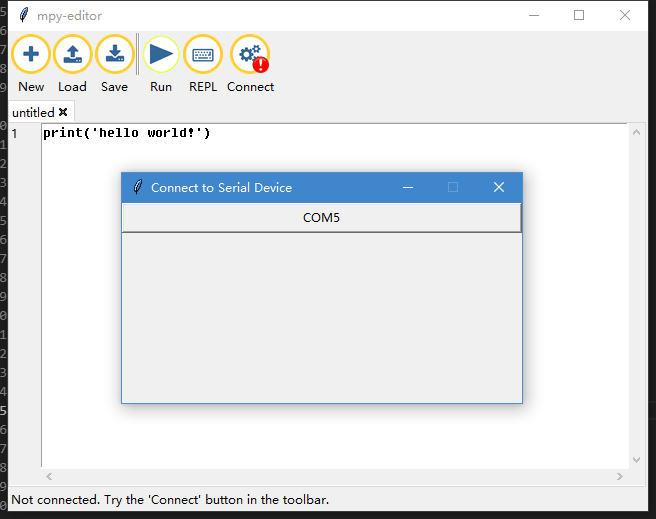
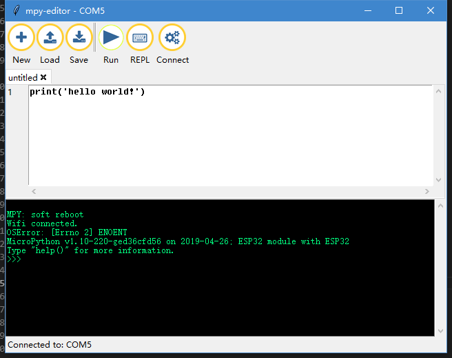
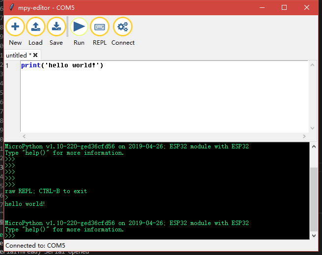
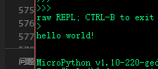
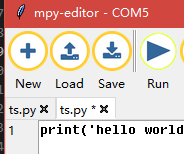

# &emsp;&emsp;&emsp;&emsp;&emsp;An easy to use MicroPython editor.

 [中文文档](README.md)

[](./LICENSE)
[](https://badge.fury.io/py/mpy-editor)

Simple! Easy! Quick! Start your micropython code!

## Features:

1. Simple code editing tools based on TK, similar as mu-editor.

2. Run automatic serial port search, prompt to connect hardware, theoretically support any connection of MicroPython firmware.

3. No judgment mechanism is added in the process of serial port connection, which can be used as a general serial port tool to receive data.

4. Hardware connected to MicroPython does not appear in upyCraft IDE's prompt to burn firmware.

5. Green single file under Windows, out of the box, or using Python for cross-platform operation.

## System requirements

- Python 3.5.4 +
- requirements.txt

## uasge

### 1. into [releases](https://github.com/junhuanchen/mpy-editor/releases) download editor.exe.

double click it.

### 2. pip insrall mpy-editor



run `pip insrall mpy-editor` in your cmd(shell), then input `editor` run it.

```shell
pip insrall mpy-editor
editor
```

## Open mpy-editor.

When opened, the current list of devices is displayed. Hardware has not been inserted yet.



## Connect your hardware.

Connect to your hardware and the port number of the current hardware will appear.



Click 'COM5' as shown in the figure to connect successfully.



## Run micropython code.

Click the button(Run) code, as shown in figure of the built-in code `print(' hello world!')`.



## Look running results.



## save or load your file.



# pyinstaller

1. create editor.spec

pyinstaller -w -F editor.py -i logo.ico

2. modify editor.spec

in 9 line editor.spec add `datas=[('mpy\\img','img')],`

3. create editor.exe

pyinstaller -w -F editor.spec -i logo.ico

# uplaod pypi

```shell
python setup.py sdist build
```

```shell
# pip install twine
twine upload dist/* --verbose
```

