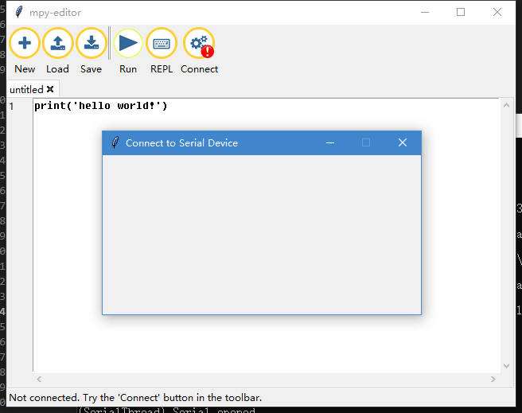
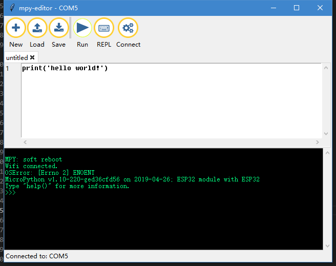
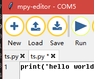

# MicroPython 编辑器 [English](English.md)

简单！容易！快速！开始你的 micropython 编程吧！

## 特点：

1. 基于 TK 制作的简易代码编辑工具，例如： Mu-editor 。

2. 运行自动查找串口，提示连接硬件，理论上支持任何 MicroPython 固件的连接。

3. 串口连接过程不添加任何判断机制，可以作为一般的串口工具接收数据使用。

4. 连接 MicroPython 的硬件不会出现 upyCraft IDE 的提示烧写固件。

5. Windows 下绿色单文件，开箱即用，也可使用 Python 跨平台运行。

## 系统要求

- Python 3.5.4 +
- requirements.txt

## 使用方法

### 1. 到 [releases](https://github.com/junhuanchen/mpy-editor/releases) 下载 editor.exe。

寻找你所用的系统版本并下载，如果下载很慢，可以用[微云地址](https://share.weiyun.com/5SVcIC3)，下载后双击运行它。

### 2. 使用 PIP 安装

使用 Python 的 PIP 工具下载并安装，在控制台中输入`pip insrall mpy-editor`，然后输入 `editor` 即可运行。

```shell
pip insrall mpy-editor

editor
```


## 运行 mpy-editor 软件

运行后会显示当前的设备列表，此时还未插入硬件。



## 连接你的硬件

连接你的硬件，此时会出现当前硬件的端口号。


点击如图的 'COM5' 即可连接。



## 运行 micropython 代码。

点击 Run (运行) 代码，如图的内置代码  `print('hello world!')` 运行即可。


## 查看运行的结果。


## 新建、加载、保存 你的代码。



# pyinstaller

1. create editor.spec

pyinstaller -w -F editor.py -i logo.ico

2. modify editor.spec

in 9 line editor.spec add `datas=[('mpy\\img','img')],`

3. create editor.exe

pyinstaller -w -F editor.spec -i logo.ico

# uplaod pypi

```shell
python setup.py sdist build
```

```shell
# pip install twine
twine upload dist/* --verbose
```

